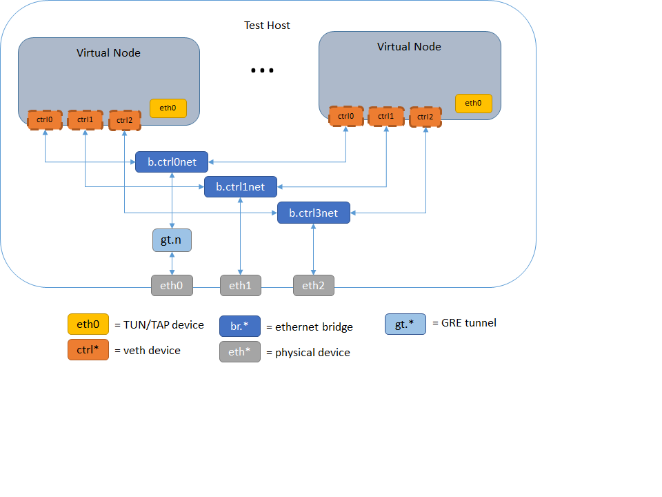

# CORE Control Network

* Table of Contents
{:toc}

## Overview

The CORE control network allows the virtual nodes to communicate with their
host environment. There are two types: the primary control network and
auxiliary control networks.  The primary control network is used mainly for
communicating with the virtual nodes from host machines and for master-slave
communications in a multi-server distributed environment. Auxiliary control
networks have been introduced to for routing namespace hosted emulation
software traffic to the test network.

## Activating the Primary Control Network

Under the *Session Menu*, the *Options...* dialog has an option to set a
*control network prefix*.

This can be set to a network prefix such as *172.16.0.0/24*. A bridge will
be created on the host machine having the last address in the prefix range
(e.g. *172.16.0.254*), and each node will have an extra *ctrl0* control
interface configured with an address corresponding to its node number
(e.g. *172.16.0.3* for *n3*.)

A default for the primary control network may also be specified by setting
the *controlnet* line in the */etc/core/core.conf* configuration file which
new sessions will use by default. To simultaneously run multiple sessions with
control networks, the session option should be used instead of the *core.conf*
default.

> :warning: If you have a large scenario with more than 253 nodes, use a control
network prefix that allows more than the suggested */24*, such as */23* or
greater.

> :warning: Running a session with a control network can fail if a previous
session has set up a control network and the its bridge is still up. Close
the previous session first or wait for it to complete. If unable to, the
*core-daemon* may need to be restarted and the lingering bridge(s) removed
manually.

```shell
# Restart the CORE Daemon
sudo /etc/init.d core-daemon restart

# Remove lingering control network bridges
ctrlbridges=`brctl show | grep b.ctrl | awk '{print $1}'`
for cb in $ctrlbridges; do
  sudo ifconfig $cb down
  sudo brctl delbr $cb
done
```

> :bulb: If adjustments to the primary control network configuration made in
*/etc/core/core.conf* do not seem to take affect, check if there is anything
set in the *Session Menu*, the *Options...* dialog. They may need to be
cleared. These per session settings override the defaults in
*/etc/core/core.conf*.

## Control Network in Distributed Sessions

When the primary control network is activated for a distributed session, a
control network bridge will be created on each of the slave servers, with
GRE tunnels back to the master server's bridge. The slave control bridges
are not assigned an address. From the host, any of the nodes (local or remote)
can be accessed, just like the single server case.

In some situations, remote emulated nodes need to communicate with the host
on which they are running and not the master server. Multiple control network
prefixes can be specified in the either the session option or
*/etc/core/core.conf*, separated by spaces and beginning with the master
server. Each entry has the form *"server:prefix"*. For example, if the servers
*core1*,*core2*, and *core3*  are assigned with nodes in the scenario and using
*/etc/core/core.conf* instead of the session option.

```shell
controlnet=core1:172.16.1.0/24 core2:172.16.2.0/24 core3:172.16.1.0/24
```

Then, the control network bridges will be assigned as follows:

* core1 = 172.16.1.254 (assuming it is the master server),
* core2 = 172.16.2.254
* core3 = 172.16.3.254

Tunnels back to the master server will still be built, but it is up to the
user to add appropriate routes if networking between control network prefixes
is desired. The control network script may help with this.

## Control Network Script

A control network script may be specified using the *controlnet_updown_script*
option in the */etc/core/core.conf* file. This script will be run after the
bridge has been built (and address assigned) with the first argument being the
name of the bridge, and the second argument being the keyword *"startup"*.
The script will again be invoked prior to bridge removal with the second
argument being the keyword *"shutdown"*.

## Auxiliary Control Networks

Starting with EMANE 0.9.2, CORE will run EMANE instances within namespaces.
Since it is advisable to separate the OTA traffic from other traffic, we will
need more than single channel leading out from the namespace. Up to three
auxiliary control networks may be defined.  Multiple control networks are set
up in */etc/core/core.conf* file.  Lines *controlnet1*, *controlnet2* and
*controlnet3* define the auxiliary  networks.

For example, having the following */etc/core/core.conf*:

```shell
controlnet = core1:172.17.1.0/24 core2:172.17.2.0/24 core3:172.17.3.0/24
controlnet1 = core1:172.18.1.0/24 core2:172.18.2.0/24 core3:172.18.3.0/24
controlnet2 = core1:172.19.1.0/24 core2:172.19.2.0/24 core3:172.19.3.0/24
```

This will activate the primary and two auxiliary control networks and  add
interfaces *ctrl0*, *ctrl1*, *ctrl2* to each node. One use case would be to
assign *ctrl1* to the OTA manager device and *ctrl2* to the Event Service
device in the EMANE Options dialog box and leave *ctrl0* for CORE control
traffic.

> :warning: *controlnet0* may be used in place of *controlnet* to configure
>the primary control network.

Unlike the primary control network, the auxiliary control networks will not
employ  tunneling since their primary purpose is for efficiently transporting
multicast EMANE OTA and  event traffic. Note that there is no per-session
configuration for auxiliary control networks.

To extend the auxiliary control networks across a distributed test
environment, host network interfaces need to be added to them. The following
lines in */etc/core/core.conf* will add host devices *eth1*, *eth2* and *eth3*
to *controlnet1*, *controlnet2*, *controlnet3*:

```shell
controlnetif1 = eth1
controlnetif2 = eth2
controlnetif3 = eth3
```

> :warning: There is no need to assign an interface to the primary control
>network because tunnels are formed between the master and the slaves using IP
>addresses that are provided in *servers.conf*.

Shown below is a representative diagram of the configuration above.


